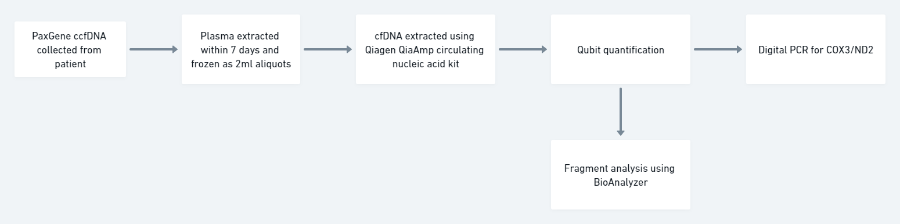
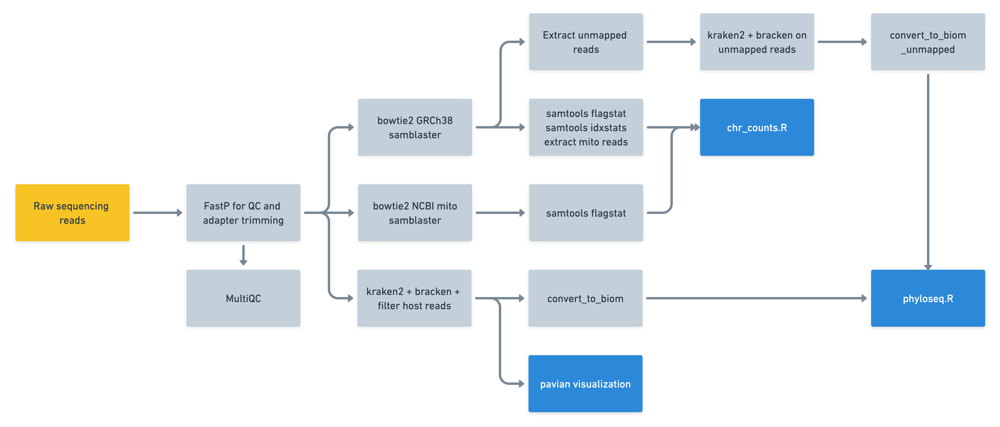

# cfDNA Analysis in R

Welcome to this repository of how I went about analysing cfDNA data.

This repository contains all data necessary to recreate the published graphs. It also contains other non-published graphs if you're interested in fully exploring the data. Anonymised de-identified clinical data is retrieved and saved to this repository. To update the clinical data you will need to have a valid API token.

## Analysis Overview

to be updated.

## Brief Comments on Methodology





Circulating cell-free DNA obtained from patients using PaxGene ccfDNA tubes (10mls of blood). These tubes undergo 1 x 1600G 10mins spin and 1 x 16000G 10mins spin at room temperature within 7 days of sampling. The resultant plasma is then portioned out into 2ml aliquots and frozen at -80.

cfDNA is then extracted from 2mls of frozen plasma using the Qiagen QiaAmp circulating nucleic acid kit (we used final elution step of 25ul of water rather than buffer AVE). During the extraction process, we run negative controls (nuclease-free water) which is run through the entire downstream pipeline. Extraction was also performed under a fume hood to minimize risk of environmental contamination and our final negative control data suggests that generally, the processes were very clean. There were 2 negative controls that were slightly raised when we were getting to grips with the extraction technique but since then everything has been pretty much perfect.

Initial quantification is performed using the Qubit hsDNA assay to quantify total cfDNA. Quantification was performed on 2ul of sample.

This extracted cfDNA then undergoes digital PCR for COX3 and ND2 mitochondrial genes using the Stilla Sapphire platform. When performing dPCR we run new negative controls (nuclease-free water) as well as negative controls from the extraction process and also positive controls which was mitochondrial DNA obtained from a cell line. Readouts were in copies/ul. If QC failed (N/A in the dPCR raw excel file), those samples were re-run.

Following dPCR the remaining cfDNA sample is sent for BioAnalyzer analysis on the Agilent 2100 instrument.

## Important Analysis Decisions 18/03/2022

1. At initial data exploration, I found that there was a single cfDNA sample with a value of 12ng/uL (way higher than all the other samples) which I think may be an outlier and this sample was excluded from the final analysis. Importantly, I ran stats both with and without the outlier and it did not change the final outcome. You can dig into the scripts and give it a go to see what I mean.

2. To simplify the visualization, IBDU was dropped as there were only 6 samples and it is hard to make too much of it. Non-IBD and healthy controls were combined. The only difference between "Non-IBD" and healthy controls were that non-IBD patients were recruited when coming up for endoscopy for other reasons (eg. bowel cancer screening). There was no difference in the final outcome whether you combine non-IBD and HC or not.

## Publishing Notes

Prior to publishing this repo to public access, remember to remove the token from `get_data_gidamps.R` and revoke it on RedCap.

## Directory outline

```sh
│   readme.md
│   installation.R # Step 1: Install project dependencies
│   example_credentials.json # Step 2: Copy to new file credentials.json and fill in with access keys.
│   gidamps_get_clinical_data.R # Step 3: Retrieve the latest GI-DAMPs data
│   music_get_clinical_data.R # Step 4: Retrieve the latest MUSIC data
│   combined_music_gidamps_dpcr.R # Run the rest of the analysis scripts
│   dpcr_assay_stats.R
│   gidamps_bioanalyzer_analysis.R
│   gidamps_bioanalyzer_make_annotations.R
│   gidamps_dpcr_analysis.R
│   music_dpcr_analysis.R
│
├───data
│   ├───dpcr_assay
│   │       cfdna_repeatability_08062022.csv
│   │
│   ├───gidamps
│   │   ├───bioanalyzer # raw bioanalyzer xml files
│   │   │
│   │   ├───bioanalyzer_annotations
│   │   │       main_annotations.csv
│   │   │       main_annotations.rds
│   │   │       sample_date_15032022.csv
│   │   │
│   │   ├───clinical
│   │   │       demographic_df.csv
│   │   │       demographic_df.rds
│   │   │       merged_df.csv
│   │   │       merged_df.rds
│   │   │       sampling_df.csv
│   │   │       sampling_df.rds
│   │   │
│   │   ├───dpcr
│   │   │       dpcr_analysis_17032022.csv
│   │   │       gidamps_dpcr_260122.xlsx
│   │   │
│   │   └───nanopore_vs_illumina
│   │           cleaned_nanopore_vs_illumina_data.csv
│   │
│   └───music
│       ├───bioanalyzer # raw bioanalyzer xml files
│       ├───clinical
│       │       music_all_03062022.csv
│       │       music_clinical_2022-06-09.csv
│       │       music_clinical_2022-06-09.rds
│       │
│       └───dpcr
│               music_cfdna_master_02062022.xlsx
│
├───docs
└───output # all script outputs here
```

## Runtime and Installation

R 4.2.0. Repository tested on both Mac and Windows.
To install dependencies, run `installation.R`

## Core Theme Settings

```R
library(ggprism)

theme_options <- theme_prism(base_size = 16) + theme(
  axis.title=element_text(size=21),
  plot.title=element_text(size=23),
  legend.position="none"
)
```

## MUSIC Data

Added 03 June 2022. Data retrieved using 1-gut/music_gidamps_notebooks.
MUSIC cfDNA completed dataset as of 02 June 2022 used.
